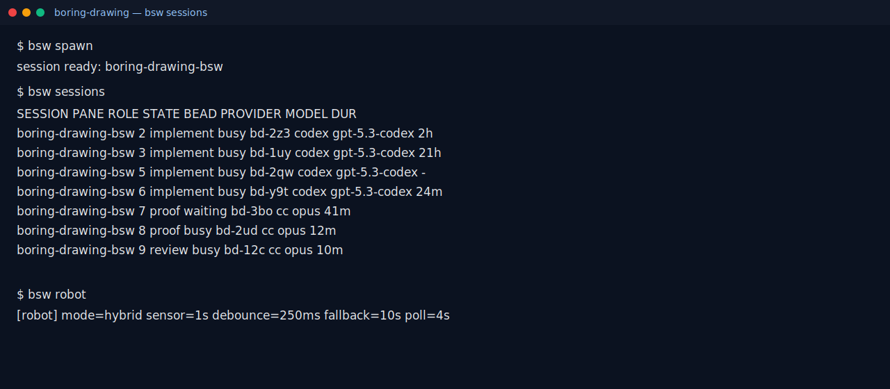
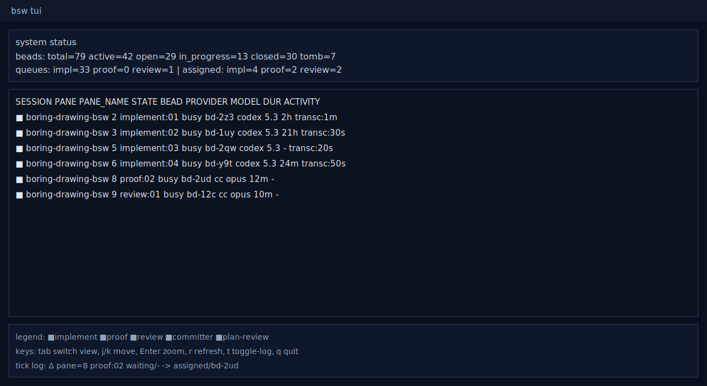

# boring-swarm

Self-contained multi-agent swarm orchestration. One binary (`bsw`), one declarative `flow.toml`, and default worker prompts.

## Install

```bash
uv tool install boring-swarm
```

Or with pip/pipx:

```bash
pipx install boring-swarm
```

## Quick Start

```bash
bsw init
bsw doctor
bsw spawn
bsw robot
```

- `bsw doctor` validates deps + local flow/prompt files.
- `bsw robot` runs hardened hybrid scheduling for autonomous operation.

## Get Started (With Screenshots)

### 1) Initialize swarm files in your project

```bash
cd /path/to/your-project
bsw init
bsw doctor
```

This creates:
- `.bsw/config.json`
- `.bsw/flow.toml`
- `.bsw/prompts/*.md`


### 2) Spawn tmux worker panes

```bash
bsw spawn
bsw sessions
```

This starts role-specific panes (`implement`, `proof`, `review`, `committer`, `plan-review`) and applies profile colors.



### 3) Start autonomous orchestration (robot mode)

```bash
bsw robot
```

`robot` runs hybrid scheduling with event + fallback ticks. It auto-assigns beads, nudges waiting workers, and can recycle unhealthy panes.

### 4) Open the TUI dashboard

```bash
bsw tui
```

Use the TUI for:
- system status and queue health
- live pane/session states
- bead lifecycle/timeline view
- tick log inspection



### 5) Customize workflow behavior

Edit `.bsw/flow.toml` to change:
- states and transitions
- worker counts per role
- provider/model/effort
- lifecycle policy (`max_idle`, `max_lifetime`, `max_busy_without_progress`)
- role colors (`color_bg`, `color_fg`, `tmux_bg`, `tmux_fg`)

DSL reference: `docs/FLOW_DSL.md`

## Structure

```
boring-swarm/
├── cli/bsw/              # Go source — compiled into platform wheels via go-to-wheel
├── defaults/
│   ├── prompts/
│   │   ├── impl_worker.md
│   │   ├── impl_proofer.md
│   │   ├── impl_reviewer.md
│   │   ├── impl_committer.md
│   │   └── plan_reviewer.md
│   └── flow.toml         # Default state machine definition
└── deps.toml             # External dependency declarations
```

## Dependencies

External — installed separately:

| Dep | Role |
|-----|------|
| **br** | Work item CRUD (beads) |
| **bv** | Verification / robot ops |
| **ntm** | Tmux session + pane management |
| **agent-mail** | Inter-agent messaging (MCP) |

## Prompt resolution

`bsw init` materializes local files:
1. `.bsw/flow.toml`
2. `.bsw/prompts/*.md`

After init, runtime reads only local `.bsw/*` files. Users can fully overwrite `flow.toml`.

## Flow DSL

- Full DSL reference: `docs/FLOW_DSL.md`
- Default example: `defaults/flow.toml`

## Build wheels locally

Requires Go 1.24+ and [go-to-wheel](https://github.com/simonw/go-to-wheel):

```bash
pip install go-to-wheel
go-to-wheel cli/bsw --name boring-swarm --version 0.1.0 --entry-point bsw
```

Wheels are built automatically on GitHub release via CI.
